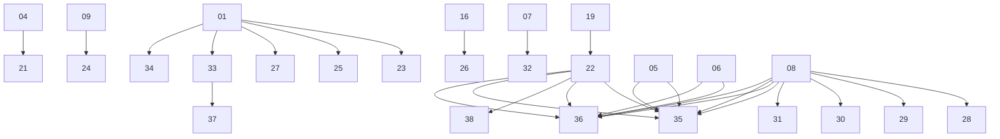

# Experiment Dependency Map

编号规则：层 0（原子）= 01-20，层 1（1 个依赖）= 21-34，层 2（多依赖）= 35-38

## 有向依赖图

## 依赖关系表

| # | 文件 | 名称 | 层 | 依赖 | 被依赖 |
|---|------|------|-----|------|--------|
| 01 | 01.mjs | config | 0 | - | 23, 25, 27, 33, 34 |
| 02 | 02.mjs | feature-flag | 0 | - | - |
| 03 | 03.mjs | provider-kit | 0 | - | - |
| 04 | 04.mjs | skill-loader | 0 | - | 21 |
| 05 | 05.mjs | codec | 0 | - | 35 |
| 06 | 06.mjs | isolation | 0 | - | 36 |
| 07 | 07.mjs | compressor | 0 | - | 32 |
| 08 | 08.mjs | qiniu | 0 | - | 28, 29, 30, 31, 35, 36 |
| 09 | 09.mjs | coding | 0 | - | 24 |
| 10 | 10.mjs | dev-aux | 0 | - | - |
| 11 | 11.mjs | backpressure | 0 | - | - |
| 12 | 12.mjs | multi-session | 0 | - | - |
| 13 | 13.mjs | process-recovery | 0 | - | - |
| 14 | 14.mjs | code-reviewer | 0 | - | - |
| 15 | 15.mjs | verify-commit | 0 | - | - |
| 16 | 16.mjs | tool-rescue | 0 | - | 26 |
| 17 | 17.mjs | step-workflow | 0 | - | - |
| 18 | 18.mjs | guardrails-pipeline | 0 | - | - |
| 19 | 19.mjs | guardian | 0 | - | 22 |
| 20 | 20.mjs | neural-brain | 0 | - | - |
| 21 | 21.mjs | teach-me | 1 | 04 | - |
| 22 | 22.mjs | tool-loop | 1 | 19 | 35, 36, 38 |
| 23 | 23.mjs | code-search | 1 | 01 | - |
| 24 | 24.mjs | edit-advanced | 1 | 09 | - |
| 25 | 25.mjs | dev-tools | 1 | 01 | - |
| 26 | 26.mjs | retry-guidance | 1 | 16 | - |
| 27 | 27.mjs | storage | 1 | 01 | - |
| 28 | 28.mjs | relay | 1 | 08 | - |
| 29 | 29.mjs | p2p | 1 | 08 | - |
| 30 | 30.mjs | naming | 1 | 08 | - |
| 31 | 31.mjs | session-tree | 1 | 08 | - |
| 32 | 32.mjs | system-exec | 1 | 07 | - |
| 33 | 33.mjs | memory | 1 | 01 | 37 |
| 34 | 34.mjs | orchestrator | 1 | 01 | - |
| 35 | 35.mjs | chat-poller | 2 | 08, 22, 05 | - |
| 36 | 36.mjs | poll-one | 2 | 08, 06, 22 | - |
| 37 | 37.mjs | dream-consolidation | 1 | 33 | - |
| 38 | 38.mjs | goal | 1 | 22 | - |
