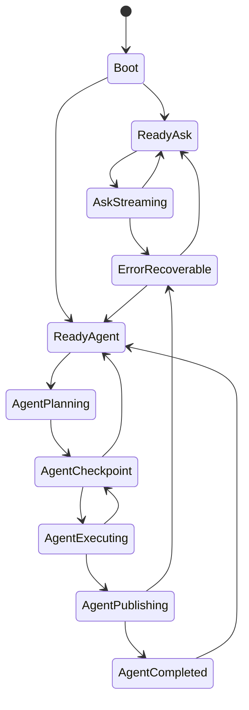

# P0 Core Design

> Scope: define the minimum architecture needed to make the Android app logically stable, recoverable, and extensible before adding more surface features.

## Product focus

The Android app should be treated as a **mobile coding companion with two execution modes**:

1. Ask mode: low-latency, multi-turn reasoning and drafting.
2. Agent mode: human-approved task package execution ending in reviewable artifacts and optional GitHub publication.

P0 explicitly rejects trying to be a general-purpose mobile IDE.

Success condition for P0:

1. User can configure provider + GitHub once.
2. User can ask follow-up questions without losing context.
3. User can submit one task goal.
4. Agent can produce one or more reviewable artifacts.
5. User can approve or reject each checkpoint.
6. If approved, agent can publish a safe PR draft.
7. If interrupted or failed, app can restore the session without corrupting state.

## Core state machine

The app should stop using ad-hoc UI state and move to one explicit root state object.



### Root state contract

Every screen render should derive from one immutable root state.

```kotlin
data class AppRuntimeState(
  val mode: RuntimeMode,
  val ask: AskSessionState,
  val agent: AgentSessionState,
  val settings: SettingsState,
  val recovery: RecoveryState,
  val lastError: AppError?
)
```

Rules:

1. UI never infers state from button visibility.
2. Long-running actions always update state before network I/O starts.
3. Background completion updates state before appending logs.
4. Every failure writes a typed `AppError` and a next allowed state.

### Ask mode states

```kotlin
sealed interface AskSessionState {
  data object Idle : AskSessionState
  data class Streaming(
    val prompt: String,
    val history: List<ChatTurn>,
    val partialResponse: String,
    val startedAtMs: Long
  ) : AskSessionState
  data class Completed(
    val history: List<ChatTurn>,
    val lastCompletedAtMs: Long
  ) : AskSessionState
}
```

Ask invariants:

1. At most one active stream.
2. A user prompt is appended before network dispatch.
3. A placeholder assistant turn exists while streaming.
4. Stream cancellation removes or seals the placeholder explicitly.
5. Persisted history is trimmed by turn count and serialized size.

### Agent mode states

```kotlin
sealed interface AgentSessionState {
  data object Idle : AgentSessionState
  data class Planning(
    val goal: String,
    val startedAtMs: Long
  ) : AgentSessionState
  data class AwaitingApproval(
    val taskPackage: TaskPackage,
    val currentCheckpoint: Checkpoint,
    val preview: ArtifactPreview
  ) : AgentSessionState
  data class Executing(
    val taskPackage: TaskPackage,
    val currentStepId: String
  ) : AgentSessionState
  data class Publishing(
    val taskPackage: TaskPackage,
    val branchName: String
  ) : AgentSessionState
  data class Completed(
    val taskPackage: TaskPackage,
    val publishedPrNumber: Int?
  ) : AgentSessionState
}
```

Agent invariants:

1. Agent never executes a mutating step without a checkpoint approval.
2. Publishing is a state, not a side effect hidden inside execution.
3. A task package is immutable once approval begins.
4. Rejection transitions to `Idle` or `Completed`, never to a half-open state.

## Failure recovery design

P0 must treat failure handling as a first-class system, not a UI toast.

### Error taxonomy

```kotlin
enum class ErrorKind {
  Validation,
  ProviderAuth,
  ProviderTimeout,
  ProviderProtocol,
  GitHubAuth,
  GitHubConflict,
  GitHubRateLimit,
  Storage,
  Cancellation,
  Unknown
}

data class AppError(
  val kind: ErrorKind,
  val code: String,
  val message: String,
  val retryable: Boolean,
  val occurredAtMs: Long,
  val stateSnapshot: String
)
```

### Recovery rules

1. Validation errors: block execution before network starts.
2. Provider auth errors: keep ask or agent session, mark credentials invalid, route user to settings.
3. Provider timeout errors: preserve input and offer retry.
4. GitHub auth errors: keep task package intact, do not drop generated artifact.
5. GitHub conflict errors: preserve artifact, require a new publish attempt after branch/base refresh.
6. Cancellation: transition to stable idle state without logging as a crash.
7. Serialization/storage errors: fall back to in-memory session and log degraded mode.

### Restore after process death

Persist these fields:

1. `mode`
2. ask history
3. active ask placeholder if streaming
4. current agent goal
5. current task package
6. last approval checkpoint
7. last recoverable error

Do not persist:

1. live network streams
2. transient progress percentages
3. stale branch SHA caches

On relaunch:

1. restore ask history immediately
2. restore agent package if present
3. mark unfinished network operations as `interrupted`
4. force user to explicitly resume publish or retry ask

### Timeout/cancel contract

Each remote action needs:

1. timeout
2. cancellation token/job ownership
3. typed failure mapping
4. one retry policy maximum in P0

P0 defaults:

1. ask request timeout: 30s
2. agent plan timeout: 45s
3. GitHub write timeout: 30s
4. no hidden infinite retries

## Task package protocol

The current app can produce artifacts, but P0 should formalize them as a task package.

```kotlin
data class TaskPackage(
  val id: String,
  val goal: String,
  val createdAtMs: Long,
  val artifactKind: ArtifactKind,
  val planSummary: String,
  val artifacts: List<Artifact>,
  val checkpoints: List<Checkpoint>,
  val publishIntent: PublishIntent,
  val rollbackHints: List<String>
)
```

```kotlin
enum class ArtifactKind {
  MarkdownDraft,
  JsonConfig,
  KotlinCode
}
```

```kotlin
data class Artifact(
  val path: String,
  val mime: String,
  val content: String,
  val summary: String
)
```

```kotlin
data class Checkpoint(
  val id: String,
  val label: String,
  val reason: String,
  val artifactPaths: List<String>
)
```

```kotlin
data class PublishIntent(
  val baseBranch: String,
  val branchName: String,
  val commitMessage: String,
  val prTitle: String,
  val prBody: String
)
```

Rules:

1. All agent outputs are normalized into `Artifact` objects.
2. Preview UI reads from `TaskPackage.artifacts`, not ad-hoc strings.
3. Publishing code reads from `PublishIntent`, not recomputed values.
4. Rollback hints are required for any mutating artifact class in future phases.

## P0 execution pipeline

### Ask path

1. validate provider config
2. append user turn
3. create placeholder assistant turn
4. open stream
5. append deltas
6. seal assistant turn
7. persist updated history
8. recover safely on timeout/auth/cancel

### Agent path

1. validate provider + GitHub settings
2. capture goal
3. generate typed task package
4. preview first checkpoint via EditGate
5. await explicit approval
6. publish artifacts to branch
7. open PR
8. persist completed package summary

## What P0 should explicitly not do

1. no general tool sandbox
2. no arbitrary repo-wide code editing
3. no background auto-publishing
4. no hidden auto-approval
5. no multi-branch orchestration
6. no full Cursor-like codebase indexing yet

## Next three highest-value commits

1. Replace `AgentLoop` string task queue with a real `TaskPackage` model persisted in local storage.
2. Introduce a single `AppRuntimeState` reducer so Ask/Agent/UI derive from one state source.
3. Add typed `AppError` + retry/resume UI so publish and ask failures always land in a recoverable state.